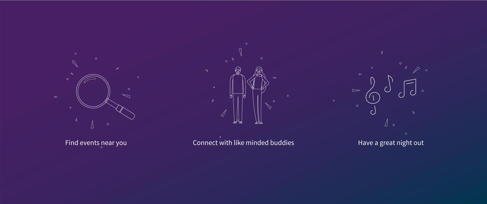

# COBY
**Find your perfect buddy for the night out**

### Explore the app
<link to go here>

## Concept
<concept here>

## Users
Coby is a safe platform for those of any age who want to meet new people while looking for a night out on the town. Whether you're new to a city or just want to expland your network of friends. 

Firstly, users will use the Coby platform to find events they're interested in around their selected town. From there they will be greeted with other like-minded 'buddies' who are also looking for others to go out with. Coby will then allow you to send a direct message* to that buddy to plan the night ahead.

## Technology & Concepts used
* Ruby on Rails
* Ticketmaster API
* CarrierWave
* Javascript
* JQuery
* AJAX
* Heroku
* SASS

## Challenges
### Git Collaboration
You all know what we're talking about...

### Conventions
After completing this project we realised the importance of deciding on naming conventions

## Lessons Learned
* Communication is key
* Don't wait around till components are built by other team mates

## WIP
* Messaging App
* Event filtering